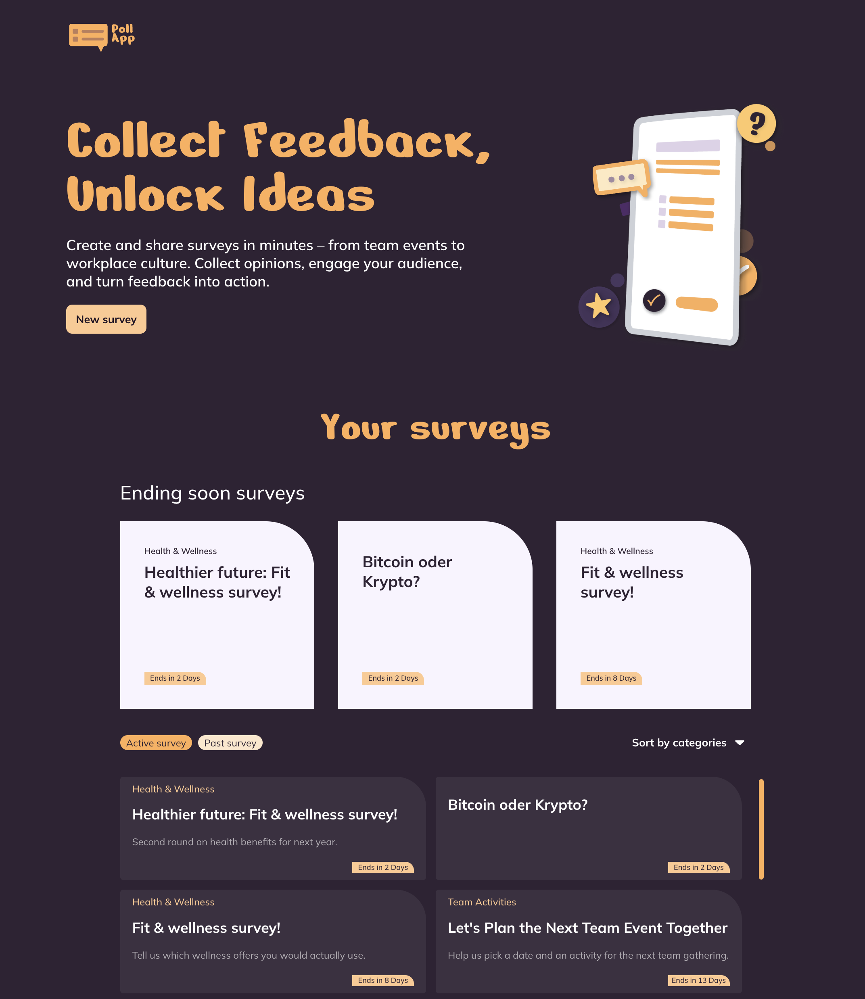

# Poll App



Poll App ist eine kleine Web-App, mit der man im Handumdrehen Umfragen erstellen und beantworten kann. Gebaut ist sie mit Angular, als Backend dient Supabase. Jede Person kann eine Umfrage anlegen, teilen, abstimmen und dabei zusehen, wie die Ergebnisse live mitwachsen. Ganz ohne Login. Umgesetzt wurde alles nach der Figma-Vorlage "Poll App Design" (Desktop 1440px und Mobile 375px).

Live anschauen: https://poll-app.lee-roy.ch

## Was die App kann

- **Startseite:** alle Umfragen auf einen Blick, sortiert nach Enddatum. Zuoberst eine eigene Reihe mit den bald endenden Umfragen, dazu die Reiter `Active` und `Past` sowie ein Kategorie-Filter.
- **Erstellen:** ein eigenes Formular, das klar zwischen Pflichtangaben (Titel, Antwortoptionen) und optionalen Angaben (Beschreibung, Enddatum, Kategorie) unterscheidet. Mit direkter Validierung und zwei bis sechs Antworten pro Frage.
- **Abstimmen:** eine laufende Umfrage öffnen, Antworten auswählen und abschliessen. Jede Frage muss beantwortet sein, bevor man absenden kann. Beendete Umfragen sind schreibgeschützt und lassen sich nicht anklicken.
- **Live-Ergebnisse:** ein horizontales Balkendiagramm, das sich beim Auswählen laufend aktualisiert. Auf dem Desktop steht es neben dem Formular, auf dem Handy klappt es hinter "See results" auf.
- **Responsive:** die Ansicht ist von grossen Bildschirmen bis zum Handy durchgestaltet und stapelt sich auf schmalen Breiten sauber untereinander.

## Technik

- Angular 21 mit Standalone-Komponenten, Signals und der nativen Kontrollfluss-Syntax
- TypeScript, SCSS (BEM plus geteilte Mixins) und HTML
- Supabase (`@supabase/supabase-js`) mit zwei Tabellen, `surveys` und `votes`
- `@fontsource/nerko-one` und `@fontsource/mulish` für die Schriften aus dem Design

## Loslegen

**Voraussetzungen:** Node.js 20 oder neuer und ein Supabase-Projekt mit dem Schema aus `supabase/schema.sql` (die Tabellen `surveys` und `votes` samt der Lese- und Insert-Policies für Row Level Security).

1. Abhängigkeiten installieren:

   ```bash
   npm install
   ```

2. Deine Supabase-URL und den anon Key in die Environment-Dateien eintragen (`src/environments/environment.ts` und `environment.development.ts`):

   ```ts
   export const environment = {
     supabaseUrl: 'https://<dein-projekt>.supabase.co',
     supabaseAnonKey: '<dein-anon-key>',
   };
   ```

3. Den Dev-Server starten:

   ```bash
   npm start
   ```

   Danach `http://localhost:4200/` im Browser öffnen.

## Bauen und veröffentlichen

```bash
ng build
```

Der Production-Build landet in `dist/poll-app/browser/`. Lade einfach den Inhalt dieses Ordners auf einen beliebigen statischen Host. Die App nutzt Hash-Routing (`/#/survey/:id`), braucht also keine serverseitigen Rewrite-Regeln und läuft auch dort, wo unbekannte Pfade mit einem 404 beantwortet werden.

## Projektstruktur

```
src/app/
  core/        Modelle, Services (SurveyService, VotesService), Utilities
  features/    home, survey-create, survey-detail
  shared/      header, survey-card, survey-list-card, category-dropdown
src/styles/    _mixins.scss (geteilte Mixins für Buttons, Badges, Checkbox und Breakpoint)
```

Die Design-Tokens (Farben, Schriften, Abstände) liegen als CSS Custom Properties in `src/styles.scss`.
